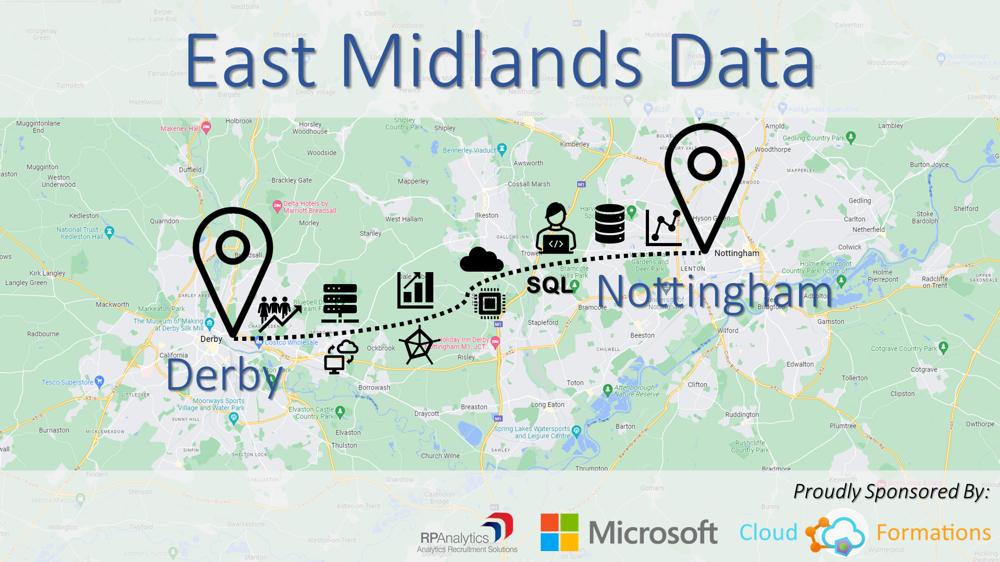

# Welcome to the East Midlands Data Meetup 👋

MeetUp home page: [https://www.meetup.com/eastmidlandsdata/](https://www.meetup.com/eastmidlandsdata/)

We're a community run Microsoft focused data user group. We provide free training, socialising, networking, recruitment, geeky debate and more on a wide range of data technology topics to anyone who wants to come along to our meetings.

Our **in-person** events run on the **second Wednesday of every month**.

To cover as much of the East Midlands as possible we currently alternate locations between **Nottingham** and **Derby**.

For additional annoucements join our community mailing list here: [bit.ly/45UE6DP](https://bit.ly/45UE6DP)

Lastly, please be aware that all our events are covered by a Code of Conduct. This can be found here: [bit.ly/EMD-CodeOfConduct](https://bit.ly/EMD-CodeOfConduct)

Thank You

East Midlands Data Organisers
organisers@eastmidlandsdata.com
